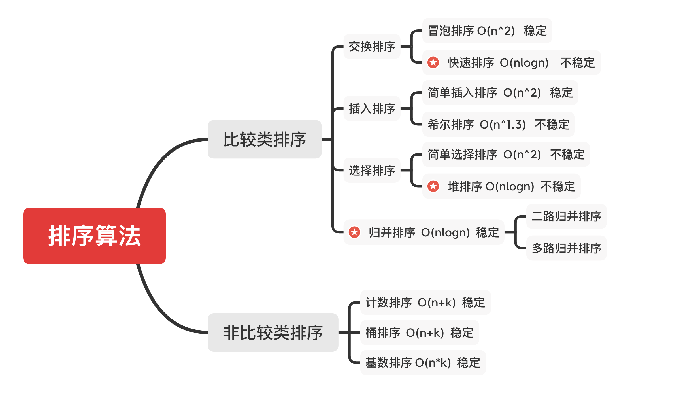

# 数据结构与算法学习

> 记录学习数据结构与算法的学习历程

### 数据结构与算法知识图谱


### 题目类型

**数组**
- [#1 Two Sum](./Leetcode-1.js)
- [#26 remove-duplicates-from-sorted-array](./Leetcode-26.js)
- [#66 plus-one](./Leetcode-66.js)
- [#88 merge-sorted-array](./Leetcode-88.js)
- [#189 rotate-array](./Leetcode-189.js)
- [#283 move-zeroes](./Leetcode-283.js)
- [#11 Container With Most Water](./Leetcode-11.js)
- [#70 Climbing Stairs](./Leetcode-70.js)
- [#15 3Sum](./Leetcode-15.js)


**链表**
- [#21 merge-two-sorted-lists](./Leetcode-21.js) ⭐️
- [#206 reverse-linked-list/](./Leetcode-206.js)
- [#24 swap-nodes-in-pairs](./Leetcode-24.js) ⭐️
- [#141 linked-list-cycle](./Leetcode-141.js)
- [#142 linked-list-cycle-ii](./Leetcode-142.js)
- [#25 reverse-nodes-in-k-group/](./Leetcode-25.js)

**哈希表**
- [#1. Two Sum](./Leetcode-1.js)
- [#49. Group Anagrams](./Leetcode-49.js)
- [#242. Valid Anagram](./Leetcode-242.js)

**二叉树遍历**
- [#94. Binary Tree Inorder Traversal](./Leetcode-94.js)
- [#144. Binary Tree Preorder Traversal](./Leetcode-144.js)
- [#429. N-ary Tree Level Order Traversal](./Leetcode-429.js)
- [#589. N-ary Tree Preorder Traversal](./Leetcode-589.js)
- [#590. N-ary Tree Postorder Traversal](./Leetcode-590.js)

**递归、回溯**
- [#22. Generate Parentheses](./Leetcode-22.js)
- [#46. Permutations](./Leetcode-46.js)
- [#47. Permutations II](./Leetcode-47.js)
- [#70. Climbing Stairs](./Leetcode-70.js)
- [#77. Combinations](./Leetcode-77.js)
- [#98. Validate Binary Search Tree](./Leetcode-98.js)
- [#104. Maximum Depth of Binary Tree](./Leetcode-104.js)
- [#105. Construct Binary Tree from Preorder and Inorder Traversal](./Leetcode-105.js)
- [#111. Minimum Depth of Binary Tree](./Leetcode-111.js)
- [#226. Invert Binary Tree](./Leetcode-226.js)
- [#236. Lowest Common Ancestor of a Binary Tree](./Leetcode-236.js)

**分治、回溯**
- [#17. Letter Combinations of a Phone Number](./Leetcode-17.js)  
- [#50. Pow(x, n)](./Leetcode-50.js)
- [#51. N-Queens](./Leetcode-51.js)
- [#78. SubSets](./Leetcode-78.js)
- [#169. Majority Element](./Leetcode-169.js)

**广度优先搜索 / 深度优先搜索**
- [#22. Generate Parentheses](./Leetcode-22.js)
- [#102. Binary Tree Level Order Traversal](./Leetcode-102.js)
- [#429. N-ary Tree Level Order Traversal](./Leetcode-429.js)
- [#515. Find Largest Value in Each Tree Row](./Leetcode-515.js)
- [#200. Number of Islands](./Leetcode-200.js)
- [#529. Minesweeper](./Leetcode-529.js)

**字符转换题**
- [#433. Minimum Genetic Mutation](./Leetcode-433.js)
- [#127. Word Ladder](./Leetcode-127.js)

**贪心算法**
- [#860. Lemonade Change](./Leetcode-860.js)
- [#122. Best Time to Buy and Sell Stock II](./Leetcode-122.js)
- [#455. Assign Cookies](./Leetcode-455.js)
- [#874. Walking Robot Simulation](./Leetcode-874.js)
- [#55. Jump Game](./Leetcode-55.js)
- [#45. Jump Game II](./Leetcode-45.js)

**二分查找**
- [#69. Sqrt(x)](./Leetcode-69.js)
- [#367. Valid Perfect Square](./Leetcode-367.js)
- [#33. Search in Rotated Sorted Array](./Leetcode-33.js)
- [#74. Search a 2D Matrix](./Leetcode-74.js)
- [练习：二分查找找有序数组断点](./binary-search.js)

**动态规划**
- [#64. Minimum Path Sum](./Leetcode-64.js)
- [#91. Decode Ways](./Leetcode-91.js)
- [#221. Maximal Square](./Leetcode-221.js)
- [#120. Triangle](./Leetcode-120.js)
- [#53. Maximum Subarray](./Leetcode-53.js)
- [#152. Maximum Product Subarray](./Leetcode-152.js)
- [#322. Coin Change](./Leetcode-322.js)
- [#198. House Robber](./Leetcode-198.js)
- [#213. House Robber II](./Leetcode-213.js)
- [#121. Best Time to Buy and Sell Stock](./Leetcode-121.js)
- [#122. Best Time to Buy and Sell Stock II](./Leetcode-122.js)
- [#621. Task Scheduler](./Leetcode-621.js)

**字典树**
- [#208. Implement Trie (Prefix Tree)](./Leetcode-208.js)
- [#212. Word Search II](./Leetcode-212.js)
- [#820. Short Encoding Of Words](./Leetcode-820.js)

**并查集、DFS、BFS**
- [#547. Friend Circles](./Leetcode-547.js)
- [#200. Number of Islands](./Leetcode-200.js)
- [#130. Surrounded Regions](./Leetcode-130.js)
- [#36. Valid Sudoku](./Leetcode-36.js)
- [#1162. As Far from Land as Possible](./Leetcode-1162.js)

**公约数问题**
- [#1071. Greatest Common Divisor of Strings]
- [#914. X of a Kind in a Deck of Cards](./Leetcode-914.js)

**位运算**
- [#191. Number of 1 Bits](./Leetcode-191.js)
- [#231. Power of Two](./Leetcode-231.js)
- [#190. Reverse Bits](./Leetcode-190.js)
- [#51. N-Queens](./Leetcode-51.js)
- [#52. N-QueensII](./Leetcode-52.js)

**LRU Cache**
- [#146. LRU Cache](./Leetcode-146.js)

**排序**
- [#912. Sort an Array](./Leetcode-912.js)
- [#1122. Relative Sort Array](./Leetcode-1122.js)
- [#242. Valid Anagram](./Leetcode-242.js)
- [#1244. Design A Leaderboard](./Leetcode-1244.js)
- [#56. Merge Intervals](./Leetcode-56.js)
- [#493. Reverse Pairs](./Leetcode-493.js)

## 学习笔记

#### 如何使用Leetcode进行算法学习
  - 不在于AC的题数量，而是针对每道题，要多练（五遍）
    - 第一遍：
      - 计时五分钟思考，写出自己能想到的可能的解法的伪代码，一般五分钟内能想到2-3个解法就是极好的
      - 如果完全没有思路，熬五分钟后直接去官网+中文网站看题解，选出3个题解，背下来
    - 第二遍：
      - 自己重新看这道题，从思路整理到代码AC，看自己是否能一遍过，如果不行，重复此操作
      - 考虑是否将此题加入到后续练习题目中
    - 第三遍：
      - 三天后，重新做自己记录的练习题目
    - 第四遍：
      - 一周后，重新做自己记录的练习题目
      - 考虑是否此题已完全掌握，移出练习题目
    - 第五遍：
      - 面试前, 重新做
      - 官网一遍
      - 中文网一遍
      - 换语言再一遍

#### Array 数组
  - 是一种线性表结构，它用一组连续的存储空间，来存储一组具有相同类型的数据
  - 线性表是指数据排列像一条线一样的数据结构，数组，链表，队列，栈，都是线性表结构
#### LinkedList 链表
  - 是一种线性表结构，它通过指针将一组零散的内存块串联在一起，这些内存块中除了存储数据外，还会记录下一个内存块的地址
  - 链表是一种物理存储单元上非连续、非顺序的存储结构，数据元素的逻辑顺序是通过链表中的指针链接次序实现的
  - 链表存在多种形式
    - 单链表
      - 只有一个后继指针的链表
    - 双链表
      - 一个后继指针，一个前驱指针
      - 占用更多空间，插入和删除效率更高
      - 空间换时间的思想
      - 实际使用例子：Java 的 LinkedHashMap
    - 循环链表
      - 尾节点指针指向头节点的链表
      - 可以是单链表，也可以是双链表
      - 约瑟夫问题
    - 静态链表
      - 用二维数组描述的链表称为静态链表
#### SkipList 跳表
  
  - 出现背景：为了弥补链表在查询中的缺陷而设计
  - 工程应用：Redis中应用广泛
  - 掌握范畴：以理解它的工作原理为主，一般不会在面试中出题
  - 设计思想：
    - 以空间换时间
    - 增加多级索引（指针）来达到跨越查询，以此来提高查询效率
    - 每个节点除了存储本身的 Next指针外，还需要存储多个跳级的指针，占用了更多的内存空间，提高了效率，此之谓空间换时间
  - 缺点：
    - 在工程中，一旦涉及到节点的增加和删除，索引就要重新更新，进而导致各个节点的跨级不一致，导致维护成本高，导致插入和删除操作的时间复杂度也会达到O(logn)而不是O(1)了
  - 复杂度分析：
    - 时间复杂度：O(logn)
    - 空间复杂度：O(n)
#### Stack 栈
  - 是一种“操作受限”的线性表，只允许在一端插入和删除数据，先进后出
  - 栈既可以用数组来实现，也可以用链表来实现
  - 用数组实现的栈，叫做顺序栈
  - 用链表实现的栈，叫做链式栈
#### Queue 队列
  - 是一种“操作受限”的线性表，只支持入队和出队操作，先进先出
  - 队列既可以用数组来实现，也可以用链表来实现
  - 用数组实现的队列，叫做顺序队列
  - 用链表实现的队列，叫做链式队列
  - Priority Queue 优先队列
    - 插入操作：O(1)
    - 取出操作：O(logn) -- 按照元素的优先级取出
    - 底层实现的数据结构较为复杂和多样：heap, BST, 红黑树, AVL, treap

#### 哈希表
- Hash Table
  - 将KeyValuePair通过哈希函数映射到数组中具体下标。存储这种KeyValuePair的数据结构

- Hash Collisions（哈希碰撞）
  - 两组KV，通过哈希函数得到了相同的下标，那么就在此下标对应的位置构建一个链表，来存储数据

#### 树的遍历
- 前序遍历  根-左-右
- 中序遍历  左-根-右
- 后续遍历  左-右-根
- 树的遍历一般都是采用递归的方式，因为树结构用循环的话会很复杂和麻烦。我们要拥抱递归

```python
// 树的遍历代码模版
def preorder(self, root):
	if root:
		self.traverse_path.append(root.val)
		self.preorder(root.left)
		self.preorder(root.right)

def inorder(self, root):
	if root:
		self.inorder(root.left)
		self.traverse_path.append(root.val)
		self.inorder(root.right)

def postorder(self, root):
	if root:
		self.postorder(root.left)
		self.postorder(root.right)
		self.traverse_path.append(root.val)
```

#### Binary Search Tree
- 动态示例Demo：[https://visualgo.net/zh/bst](https://visualgo.net/zh/bst)
- 指一棵空树或者具有下列性质的二叉树
    - 左子树上所有结点的值 < 根结点值
    - 右子树上所有结点的值 > 根结点值
- 常见操作
    - 查询 O(logn)
    - 插入 O(logn)
    - 删除 O(logn)
        - 如果删除的结点存在子结点，则先找到比该结点值大的第一个元素，将其替换后，删除该结点
- tips
  - 树和图最关键的差别，就是看有没有环
  - 链表是特殊化的树，树是特殊化的图（没有环的图就是树）


#### 递归、回溯
```python
// 递归代码模版
def recursion(level, params1, params2, ...):
	# recursion terminator 终止条件
	if level > MAX_LEVEL
		process_result
		return

	# process logic in current level 处理当前层逻辑
	process(level, data...)

	# drill down 下探到下一层
	self.recursion(level+1, p1, ...)
	
	# reverse the current level status if needed 清理当前层
```

```python
// 回溯代码模版
result = []
def backtrack(路径，选择列表):
	if 满足结束条件:
		result.add(路径)
		return
	for 选择 in 选择列表
		做选择
		backtrack(路径，选择列表)
		撤销选择
```

- Backtracking 回溯
  - 回溯法是暴力搜索法中的一种（from wikipedia）
  - 回溯法是一种可以找出所有（或一部分）解的一般性算法，尤其适用于约束满足问题
  - 回溯法采用试错的思想，它尝试分步的去解决一个问题。在分步解决问题的过程中，当它通过尝试发现现有的分步答案不能得到有效的正确的解答的时候，它将取消上一步甚至是上几步的计算，再通过其它的可能的分步解答再次尝试寻找问题的答案。回溯法通常用最简单的递归方法来实现，在反复重复上述的步骤后可能出现两种情况：
      - 找到一个可能存在的正确的答案
      - 在尝试了所有可能的分步方法后宣告该问题没有答案
  - 在最坏的情况下，回溯法会导致一次复杂度为指数时间的计算。
  - 参考资料
      - [https://zh.wikipedia.org/wiki/回溯法](https://zh.wikipedia.org/wiki/%E5%9B%9E%E6%BA%AF%E6%B3%95)

#### 分治、回溯的实现和特性

- 分治和回溯都是递归而已
- 分治（Divide & Conquer）：将一个大问题分成若干小问题，解决掉这些小问题，Merge回去，就解决了大问题
  ```javascript
  // 递归
  const recursion = (level, params) => {
    // recursion terminator
    if (level > MAX_LEVEL) {
      process_result
      return
    }
    // process current level
    process(level, params)
    // drill down
    recursion(level + 1, params)
    // clean current level status if needed	
  }
  
  // 分治
  const divide_conquer = (problem, params) => {
    // recursion terminator
    if (problem == null) {
      process_result
      return
    } 
    // process current problem
    subproblems = split_problem(problem, data)
    subresult1 = divide_conquer(subproblem[0], p1)
    subresult2 = divide_conquer(subproblem[1], p1)
    subresult3 = divide_conquer(subproblem[2], p1)
    ...
    // merge
    result = process_result(subresult1, subresult2, subresult3)
    // revert the current level status
  }
  ```

#### 深度优先搜索 DFS

- 递归、栈来实现
    ```python
    def dfs(node):
    	if node in visited:
    		return
    	visited.add(node)
    	dfs(node.left)
    	dfs(node.right)

#### 广度优先搜索 BFS

- 队列实现
    ```python
    def bfs(graph, start, end):
      queue = []
      queue.append([start])
      visited.add(start)

      while queue:
        node = queue.pop()
        visited.add(node)
        process(node)
        nodes = generate_related_nodes(node)
        queue.push(nodes)

    // BFS
    const BFS = (root) => {
      if (!root) return []
      let result = [], queue = [root]
      while (queue.length > 0) {
        let level = [], n = queue.length
        for (let i = 0; i < n; i++) {
          let node = queue.pop()
          level.push(node.val) 
          if (node.left) queue.unshift(node.left)
          if (node.right) queue.unshift(node.right)
        }
        result.push(level)
      }
      return result
    };

#### 贪心算法

- 是一种在每一步选择中都采取在当前状态下最好或最优的选择，不能回退，从而希望导致结果是全局最好或最优的算法
- 解决一些最优问题，如：求图中的最小生成树、哈夫曼编码。然而对于工程和生活上的问题，贪心算法一般不能得到我们所要求的答案
- 那为什么还会有这个算法呢？因为一旦一个问题通过贪心算法来解决，那么贪心算法一般是解决这个问题的最好办法。由于贪心算法的高效性以及其所求得的答案比较接近最优结果。

#### 贪心算法、回溯算法、动态规划

- 贪心算法：只会当下做局部最优判断且不能回退
- 回溯算法：能够回退
- 动态规划：会保存之前的运算结果，根据以前的结果对当前进行选择，可以回退

#### 二分查找

- 使用二分查找的条件
    - 有序
    - 存在上下界
    - 能够通过索引访问
    ```python
    # 代码模版
    left, right = 0, len(array) - 1
    while left <= right:
      mid = (left + right) / 2
      if array[mid] == target:
        # find the target
        return
      elsif array[mid] < target:
        left = mid + 1
      else
        right = mid - 1

#### 动态规划

动态规划 和 递归或者分治 没有根本上的区别

- 共性：找到重复子问题
- 差异性：动态规划是找到最优子结构，中途淘汰次优解；如果没有最优子结构，那就变成了分治算法了
- 也正是存在最优子结构，所以动态规划的时间复杂度会明显由于指数级的分治算法

动态规划关键点

- 最优子结构 opt[n] = best_of(opt[n-1], opt[n-2])  （第n个的值等于前面几个值的关系）
- 储存中间状态：opt[i]
- 递推公式
    - Fib：opt[i] = opt[n-1] + opt[n-2]
    - 二维路径：opt[i,j] = opt[i+1][j] + opt[i][j+1] （且判断a[i,j]是否空地）

动态规划思维框架

- 采用自底向上的思维方式（for循环）(PS:  递归、分治等都是采用自顶向下的思维方式，构造递归树）
- 动态规划问题的一般形式就是求最值，其实是运筹学的一种最值优化方法
- 既然是求最值，核心问题是什么？是穷举。因为要求最值，肯定要把所有可行的答案穷举出来找
- 但是动归的穷举有点特别，因为这类问题存在「**重叠子问题**」，所以可以通过「备忘录」或者「DP Table」来优化穷举过程，避免不必要的计算
- 而且，动态规划问题一定会具备「**最优子结构**」，才能通过子问题的最值得到原问题的最值。
- 而要要找重叠子问题以及最优子结构，只有列出正确的「**状态转移方程**」才能正确地穷举
    - 先明确「状态」—— 原问题和子问题中变化的变量
        - 例如 coin change 问题，状态是目标金额 amount
    - 确定 dp 函数的定义 ——- 也就是问题
        - 例如 coin change 问题，dp(n) 表示至少需要 dp(n) 个硬币凑出目标金额 n
    - 确定「选择」并择优 ——  也就是对于每个状态，可以做出什么选择，改变当前状态
        - 例如 coin change 问题，无论当前的目标金额是多少，选择就是从 coins 中选择一个硬币，然后目标金额就会减少
    - 最后明确 base case
        - 例如 coin change 问题，显然目标金额为 0 时，所需硬币数量为 0；当目标金额小于 0 时，无解，返回 -1

解决动态规划类问题的一般优化顺序

- Find recursive relation
- Recursive（top-down)
- Recursive + memo (top-down)
- Iterative + memo (bottom-up)
- Iterative + N variables (bottom-up)

**位运算**
- 为什么需要位运算
  - 直接进行二进制运算，速度快，比十进制运算要快很多
- 位运算常用场景
  - 判断奇偶
      - x % 2 == 1  ——>  (x & 1) == 1  (判断二进制最后一位是0或1)
      - x % 2 == 0 ——>  (x & 1) == 0
  - 除2运算
      - x = x / 2 ——>  x = x >> 1 (右移一位)
  - 清零最低位的1
      - x = x & (x-1)
  - 得到最低位的1
      - x & -x
  - x & ~x =⇒ 0

**布隆过滤器（Bloom Filter）**
- 是什么
    - 一个很长的二进制向量和一系列随机映射函数
- 干嘛用
    - 用于检索一个元素是否在一个集合中
- 为什么用它
    - Bloom Filter vs Hash Table
        - 哈希表是精确存储信息，如果产生哈希冲突会采用拉链式存储，保证所有数据都存储精确
        - 布隆过滤器的空间效率和查询效率都远远超过一般的算法
        - 布隆过滤器是一种模糊的查询方式，缺点是有一定的误识别率和删除困难

**LRU Cache**
- 常规实现：Hash Table + Double LinkedList
- 效率： 查询、修改都是 O(1)

**比较类排序**
- 通过比较来决定元素间的相对次序，其时间复杂度不能突破 O(nlogn)，属于非线性时间排序
- 适用于各种数据结构，数字类型，字符串类型，对象类型等

**非比较类排序**
- 不通过比较来决定元素间的相对次序，它可以突破基于比较排序的时间下界，以线性时间运行，属于线性时间排序
- 一般只适用于整数型数据，同时需要额外的内存空间



### 初级排序 O(n^2)

- 选择排序
    - 每次找最小值，然后放到待排序数组的起始位置
      ```javascript
      // 选择排序
      export default (nums) => {
        for (let i = 0; i < nums.length; i++) {
          let min = nums[i]
          for (let j = i+1; j < nums.length; j++) {
            if (nums[j] < min) [nums[j], min] = [min, nums[j]]
          }	
          arr[i] = min
        }
      }
      ````

- 插入排序
    - 从前到后逐步构建有序序列；对于未排序数据，在已排序序列中从后向前扫描，找到相应位置并插入
      ```javascript
      // 插入排序
      export default (nums) => {
        for (let i = 1; i < nums.length; i++) {
          for (let j = i; j > 0; j--) {
            if (nums[j-1] <= nums[i]) break
            nums[j] = nums[j-1]
          }
          nums[j] = nums[i]
        }
      }
      ```

- 冒泡排序
    - 嵌套循环，每次查看相邻的元素如果逆序，就交换
      ```javascript
      // 冒泡排序
      export default (nums) => {
        for (let i = nums.length-1; i > 0; i--) {
          for (let j = 0; j < i; j++) {
            if (nums[j] > nums[j+1]) [nums[j], nums[j+1]] = [nums[j+1], nums[j]]
          }		
        }
      }
      ```

### 高级排序 O(nlogn)

- 快速排序
    - 数组取标杆 pivot，将小元素放在 pivot 左边，大元素放右侧，然后依次对右边和右边的子数组继续快排；以达到整个序列有序
      ```javascript
      // 快速排序
      const quickSort = (nums, left, right) => {
        if (nums.length <= 1) return nums
        if (left < right) {
          index = partition(nums, left, right)
          quickSort(nums, left, index-1)
          quickSort(nums, index+1, right)
        }
      }
      
      const partition = (nums, left, right) => {
        let pivot = left, index = left + 1
        for (let i = index; i <= right; i++) {
          if (nums[i] < nums[pivot]) {
            [nums[i], nums[index]] = [nums[index], nums[i]]
            index++
          }
        }
        [nums[pivot], nums[index-1]] = [nums[index-1], nums[pivot]]
        return index
      }
      
      quickSort(nums, 0, nums.length-1)
      return nums
      ```
        

- 归并排序
    - 把长度为 n 的序列分成两个长度为 n/2 的子序列
    - 对子序列分别采用归并排序
    - 将两个排序好的子序列合并成一个最终的排序序列
      ```javascript
      // 归并排序
      const mergeSort = (nums) => {
        if (nums.length <= 1) return nums
        let mid = Math.floor(nums.length/2), 
            left = nums.slice(0, mid), 
            right = nums.slice(mid)
        return merge(mergeSort(left), mergeSort(right))
      }
      
      const merge(left, right) => {
        let result = []
        while(left.length && right.length) {
          result.push(left[0] <= right[0] ? left.shift() : right.shift()
        }
        while(left.length) result.push(left.shift())
        while(right.length) result.push(right.shift())
        return result
      }
      ```
    - 归并和快排具有相似性，但步骤顺序相反
        - 归并：先一分为二，分成左右子数组，分别排序左右子数组，再合并
        - 快排：先选择pivot，然后分成左右，左边为已排序，再对右子数组继续快排，以达到整个序列有序

- 堆排序
    - 分大顶堆和小顶堆
    - 插入、删除堆操作 O(logn)，取最大值最小值都是 O(1)
    - 数组元素依次建立小顶堆
    - 依次取堆顶元素，并删除
- 计数排序
    - 计数排序的核心在于将输入的数据值转化为键存储在额外开辟的数组空间中。作为一种线性时间复杂度的排序，计数排序要求输入的数据必须是有确定范围的整数。
- 桶排序
    - 桶排序是计数排序的升级版。它利用了函数的映射关系，高效与否的关键就在于这个映射函数的确定。为了使桶排序更加高效，我们需要做到这两点：
        1. 在额外空间充足的情况下，尽量增大桶的数量
        2. 使用的映射函数能够将输入的 N 个数据均匀的分配到 K 个桶中
    - 同时，对于桶中元素的排序，选择何种比较排序算法对于性能的影响至关重要。
- 基数排序
    - 先排各位的值，0-9；再排十位的值，0-9；依此类推
    - 基数排序是一种非比较型整数排序算法，其原理是将整数按位数切割成不同的数字，然后按每个位数分别比较。由于整数也可以表达字符串（比如名字或日期）和特定格式的浮点数，所以基数排序也不是只能使用于整数。

**扩展阅读**

- 十大经典排序算法多语言实现  [https://sort.hust.cc/](https://sort.hust.cc/)


#### [代码模版汇总](./Templates.md)